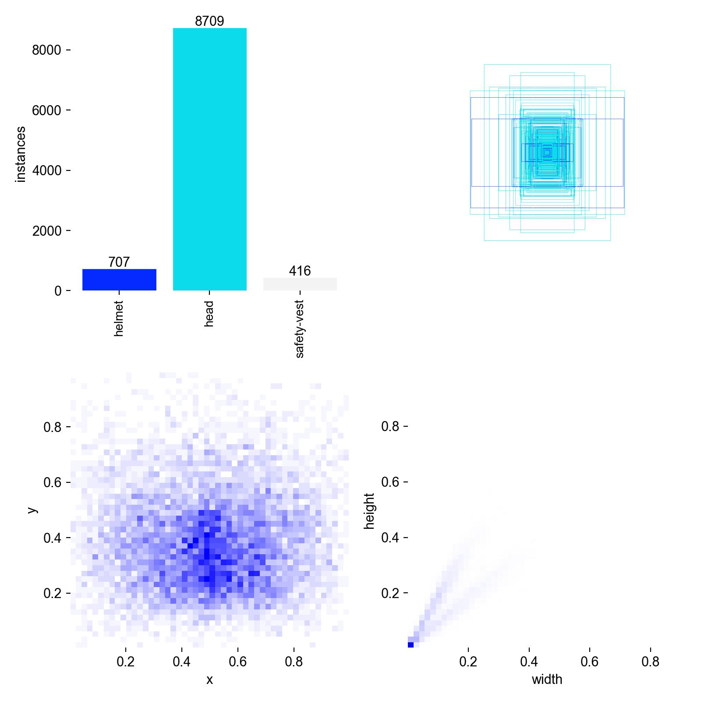
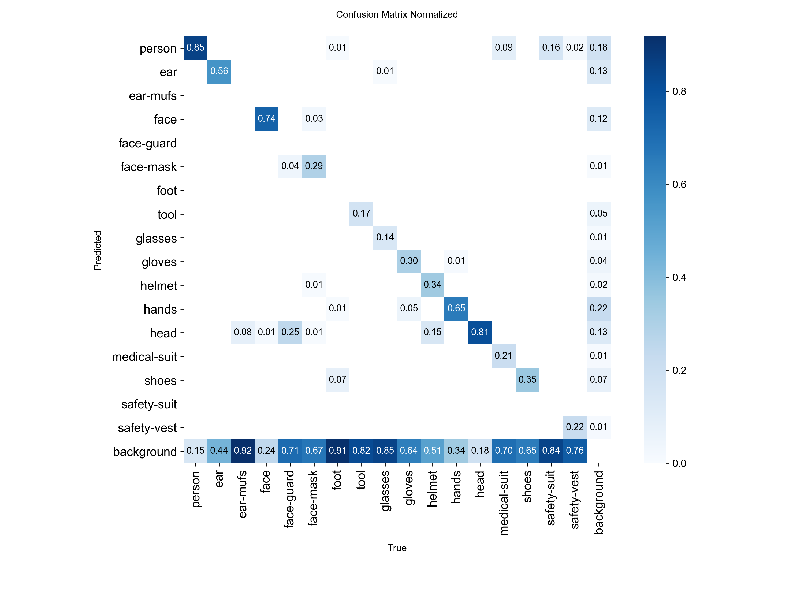
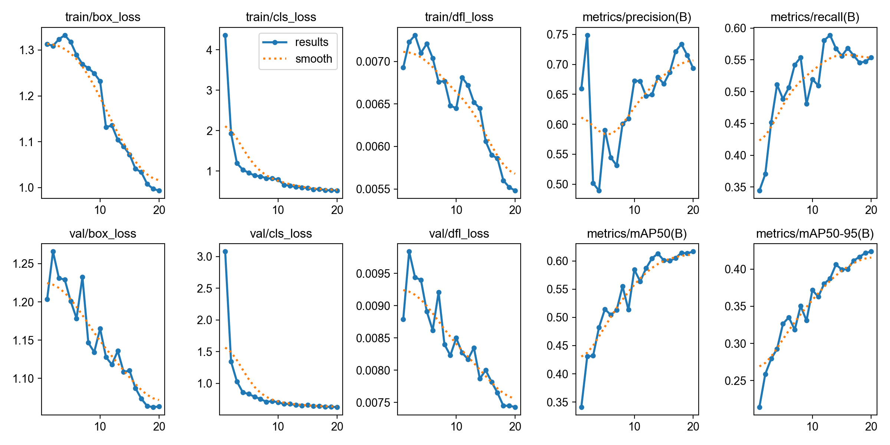
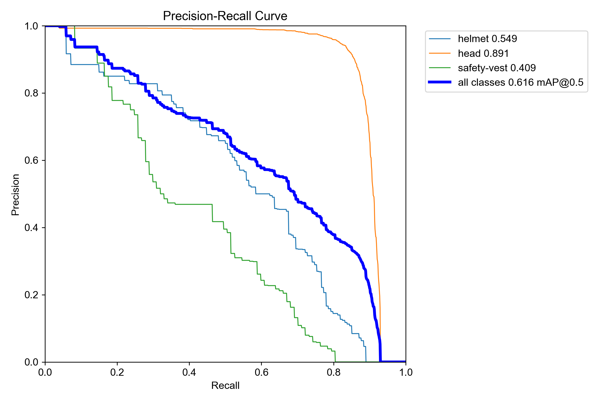
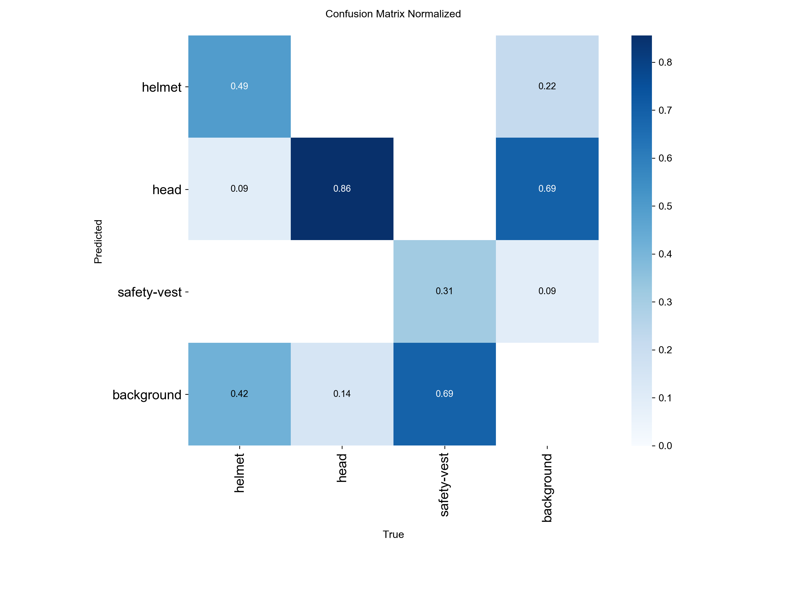
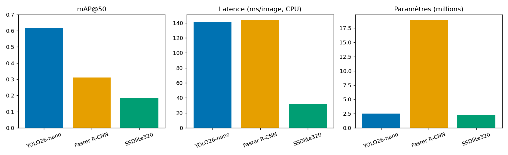

# Projet Computer Vision — Détection automatique d'EPI sur chantier

**Bloc 2 – Projet 1** — Piloter et implémenter des solutions d'IA en s'aidant notamment de l'IA générative
RNCP40875 – Expert en ingénierie de données
Jonathan White

## Sommaire

1. [Introduction](#1-introduction)
2. [Préparation de la donnée](#2-préparation-de-la-donnée)
3. [Analyse exploratoire des données](#3-analyse-exploratoire-des-données)
4. [Choix et configuration du modèle](#4-choix-et-configuration-du-modèle)
5. [Évaluation](#5-évaluation)
6. [Inférence](#6-inférence)
7. [Partie 2 : Analyse avancée et déploiement](#7-partie-2--analyse-avancée-et-déploiement)
8. [Évaluation comparative des modèles](#8-évaluation-comparative-des-modèles)
9. [Stratégie d'intégration de l'IA](#9-stratégie-dintégration-de-lia)
10. [Livrables](#10-livrables)
11. [Conclusion](#11-conclusion)

---

## 1. Introduction

**Cadre.** Ce projet s'inscrit dans le Bloc 2 (RNCP40875 — Expert en ingénierie de données),
sur le thème de la détection automatique d'EPI sur chantier de construction par computer
vision.

**Contexte.** Les accidents du travail sur les chantiers restent un enjeu majeur de
sécurité. Le contrôle du port des Équipements de Protection Individuelle (casque, gilet
réfléchissant, gants, etc.) reste aujourd'hui manuel, ponctuel et donc structurellement
insuffisant : un chef de chantier ne peut pas surveiller en continu une équipe répartie
sur plusieurs milliers de m². L'objectif est de concevoir un système capable de détecter
automatiquement, à partir d'images ou de flux vidéo, le port ou l'absence des EPI
critiques, et de déclencher une alerte visuelle en cas de non-conformité.

**Objectifs.**
1. Préparer et analyser le dataset SH17 (8 099 images, 17 classes liées à la sécurité
   humaine en environnement industriel).
2. Entraîner et comparer plusieurs modèles de détection d'objets.
3. Construire un tableau de bord interactif exploitable par les équipes sécurité.
4. Proposer une stratégie réaliste d'intégration de la solution dans les processus
   métiers existants.

**Méthodologie.** Le projet suit le pipeline classique de la vision par ordinateur :
préparation/nettoyage des données → analyse exploratoire → modélisation → évaluation
comparative → stratégie de déploiement. Le détail technique (code, sorties, graphiques)
est disponible dans `Modeles/projet.ipynb` et `Modeles/comparatif/`.

## 2. Préparation de la donnée

### 2.1 Réorganisation du dataset

Le dépôt SH17 fournit toutes les images dans un seul dossier, avec des fichiers
`train.txt` / `val.txt` listant les noms de fichiers par split. J'ai réorganisé le
dataset au format attendu par YOLO :

```
dataset_yolo/
  images/{train,val,test}/
  labels/{train,val,test}/
```

En lisant les fichiers `train_files.txt` / `val_files.txt` et en copiant chaque image et
son label correspondant dans le bon dossier (le test étant déduit du reste). J'ai
également généré le fichier `sh17.yaml` nécessaire à YOLO (chemins des dossiers + 17
classes).

### 2.2 Exploration et statistiques (ratio de classes)

La classe majoritaire est HANDS (id=11) et la classe minoritaire est FACE-GUARD (id=4),
avec un ratio de 118,3 : la classe majoritaire est représentée 118 fois plus souvent que
la minoritaire.



Ce déséquilibre est très important et a un impact direct sur l'apprentissage : le modèle
voit très peu d'exemples des classes rares (face-guard, ear-mufs, safety-suit...) et a
donc beaucoup de mal à les détecter correctement, là où les classes fréquentes (person,
hands, head, face...) sont bien apprises.

### 2.3 Statistiques sur la taille des bounding boxes

Une bounding box est considérée comme « petite » si son aire représente moins de 1 % de
l'image, « moyenne » entre 1 % et 10 %, et « grande » au-delà. On observe énormément de
petites boxes : le modèle a donc des difficultés à les détecter, ce qui a motivé le choix
d'augmentations dédiées (voir 2.5).

### 2.4 Pré-traitement

- **Redimensionnement** : les images n'ont pas toutes la même résolution d'origine ; YOLO
  redimensionne automatiquement à 640×640 (`imgsz=640`), résolution d'entrée du modèle
  choisi (YOLO26-nano).
- **Normalisation** : YOLO normalise en interne les pixels de [0, 255] vers [0,0, 1,0]
  avant de les passer au réseau.
- **Débruitage** : aucun artefact constaté lors de l'exploration visuelle → aucun
  débruitage appliqué.
- **Recadrage (crop) des petits objets** : les statistiques montrent qu'une part
  importante des bounding boxes sont de petite taille. Le paramètre `scale` de YOLO
  imite ce travail de zoom aléatoire ; ce comportement natif a été privilégié plutôt
  qu'un recadrage manuel.

### 2.5 Augmentation des données

Trois types d'augmentations ont été mis en place et illustrés :

- **Variations d'éclairage** : assombrissement global (effet nuit, réduction de la
  composante V en HSV), éblouissement (ajout d'une valeur constante aux pixels),
  contre-jour (gradient de luminosité horizontal).
- **Changements d'angle de vue** : rotation de 30°, flips horizontal et vertical.
- **Occlusions partielles** : rectangle noir placé aléatoirement sur l'image.

Lors de l'entraînement final, ces augmentations sont activées via les paramètres YOLO
`fliplr=0,5` (flip horizontal aléatoire) et `hsv_v=0,5` (variation de luminosité
aléatoire), qui correspondent directement aux transformations illustrées.

### 2.6 Choix méthodologiques

Aucune image n'a été supprimée manuellement : l'exploration visuelle n'a pas révélé
d'images floues, mal cadrées ou inexploitables sur l'échantillon examiné. Le déséquilibre
de classes est traité en aval, via le choix d'un sous-ensemble ciblé de 3 classes
prioritaires (Axe B, section 7.1) plutôt que par sur-échantillonnage — un choix guidé par
la pertinence métier (casque, tête nue, gilet) plutôt que par un objectif purement
statistique.

## 3. Analyse exploratoire des données

### 3.1 Techniques statistiques utilisées

- Répartition des classes d'EPI dans le dataset (histogramme par classe, cf. notebook
  section 1.2) — confirme le déséquilibre documenté en 2.2.
- Analyse de la taille des bounding boxes (petites/moyennes/grandes) — cf. 2.3.
- Visualisation d'exemples annotés sur les trois splits (train/val/test) pour valider
  visuellement la cohérence des annotations.

### 3.2 Insights métiers

- **Biais identifié** : les classes rares (face-guard, ear-mufs, safety-suit) sont
  structurellement sous-représentées ; un système de détection généraliste sur les 17
  classes sera peu fiable sur ces équipements spécifiques sans données complémentaires
  ciblées.
- **Petits objets** : la prédominance de petites bounding boxes indique que les EPI
  détectés à distance (chantier large, caméra fixe) seront plus difficiles à détecter
  qu'en plan rapproché — un point à anticiper lors du choix des positions de caméra en
  déploiement réel.
- **Recommandation** : prioriser l'entraînement et le contrôle qualité sur un nombre
  restreint de classes à fort enjeu sécurité (casque, gilet) plutôt que sur les 17 classes
  du dataset, cohérent avec l'approche adoptée en Axe B.

## 4. Choix et configuration du modèle

### 4.1 Choix du modèle

YOLO a été retenu car :
- Le projet impose de traiter des flux vidéo en temps réel, ce qui élimine d'office
  Faster R-CNN pur (architecture en deux étapes, plus lente) pour un usage production.
- Le dataset est fortement déséquilibré : un modèle léger et facile à fine-tuner via
  transfer learning (YOLO pré-entraîné sur COCO) est un bon compromis.
- YOLO est l'architecture étudiée en cours et la mieux maîtrisée pour ce projet.

Voir section 8 pour la comparaison chiffrée avec deux architectures alternatives
(Faster R-CNN, MobileNet/SSD), demandée par le sujet.

### 4.2 Configuration, entraînement et régularisation

**Architecture retenue.** Aucune modification d'architecture n'a été apportée : seule la
tête de détection est ré-entraînée pour s'adapter aux 17 classes du dataset.

**Stratégie de transfer learning.** Utilisation des poids pré-entraînés COCO, avec gel
des 10 premières couches (backbone d'extraction de caractéristiques bas-niveau : contours,
textures, formes simples), génériques et transférables. Les couches profondes (tête de
détection) sont ré-entraînées sur les 17 classes du dataset.

**Hyperparamètres utilisés :**

| Hyperparamètre | Valeur | Justification |
|---|---|---|
| Epochs | 20 | Compromis temps/qualité sur CPU |
| Batch size | 16 | Adaptée au CPU disponible |
| Image size | 640 | Résolution standard YOLO |
| Learning rate (lr0) | 0,01 | Valeur par défaut éprouvée pour le fine-tuning YOLO |
| Patience (early stopping) | 10 | Arrête l'entraînement si aucune amélioration de la mAP sur validation pendant 10 epochs |
| fliplr | 0,5 | Flip horizontal aléatoire (augmentation) |
| hsv_v | 0,5 | Variation aléatoire de la luminosité (augmentation) |

## 5. Évaluation

Métriques calculées sur le jeu de test (modèle 17 classes) :
- mAP@50 : 0,406
- mAP@50-95 : 0,247

**Choix de la métrique prioritaire.** Dans ce projet, le RAPPEL est plus adapté que la
précision, car il est plus important de minimiser les faux négatifs (ne pas manquer un
travailleur non conforme) que d'éviter les faux positifs (fausses alertes). Le rappel
global observé est faible et très hétérogène selon les classes, directement lié au
déséquilibre du dataset : le modèle n'a pas vu assez d'exemples des classes rares pour
apprendre à les détecter.



## 6. Inférence

Le modèle a été testé sur une image et une vidéo du jeu de test. La détection identifie
les classes présentes (person, face, hands, head, shoes...). Une règle de conformité
simple a été définie : un travailleur est considéré non conforme si une partie du corps
est détectée sans son équipement de protection associé (ex : head → helmet, person →
safety-vest, face → glasses, hands → gloves). Si une non-conformité est détectée, un
bandeau visuel "NON CONFORME - EPI MANQUANT" est affiché.

Cette règle est arbitraire et devrait s'adapter à chaque corps de métier — un point
repris dans la stratégie d'intégration (section 9).

## 7. Partie 2 : Analyse avancée et déploiement

### 7.1 Axe B : Focus classes EPI

L'objectif de cet axe est de restreindre l'entraînement aux trois classes directement
liées à la conformité EPI : helmet (id=10), head (id=12) et safety-vest (id=16).

Un nouveau dataset `dataset_yolo_epi` a été créé en parcourant tous les fichiers de
labels du dataset original, en ne conservant que les lignes correspondant aux classes
10, 12 et 16, et en remappant leurs identifiants : 10 → 0 (helmet), 12 → 1 (head),
16 → 2 (safety-vest). Un nouveau fichier `sh17_epi.yaml` décrivant ces 3 classes a été
généré, et un nouvel entraînement a tourné avec les mêmes hyperparamètres.

La restriction de l'entraînement aux seules classes EPI améliore les performances du
modèle par rapport au modèle 17 classes : la présence de nombreuses classes déséquilibrées
diluait la capacité d'apprentissage du réseau. Ce modèle EPI 3 classes est celui utilisé
par défaut dans l'application Streamlit.







### 7.2 Axe E : Interface de démonstration (Streamlit)

Voir section 10.2 (Application Streamlit) pour le détail des fonctionnalités du tableau
de bord.

## 8. Évaluation comparative des modèles

Conformément au sujet, trois architectures ont été entraînées et comparées sur le même
dataset EPI (3 classes) :

| Modèle | Famille | Poids initiaux |
|---|---|---|
| YOLO26-nano (Ultralytics) | one-stage, temps réel | pré-entraîné COCO |
| Faster R-CNN (backbone MobileNetV3-FPN, torchvision) | two-stage, plus précis mais plus lent | pré-entraîné COCO |
| SSDlite320 (backbone MobileNetV3, torchvision) | one-stage, très léger, edge computing | pré-entraîné COCO |

**Protocole.** Les modèles torchvision (Faster R-CNN, SSDlite) ont été fine-tunés sur un
sous-ensemble du dataset EPI (images redimensionnées, entraînement de la tête de
détection uniquement, quelques epochs) — un compromis assumé face aux contraintes de
calcul (CPU/GPU Apple Silicon, pas de cluster GPU dédié), cohérent avec le choix déjà fait
pour YOLO (20 epochs, cf. 4.2). Le tableau chiffré complet, généré automatiquement par
`Modeles/comparatif/train_eval.py`, est disponible dans
`Modeles/comparatif/RESULTATS.md` (précision/rappel/F1/AP@50 par classe, latence par
image, nombre de paramètres comme proxy de l'empreinte énergétique).

**Critères de comparaison :**
- Précision, rappel, F1-score, mAP@50
- Latence (ms/image) — pertinent pour la détection en temps réel
- Nombre de paramètres (proxy de la consommation énergétique / de l'aptitude à l'edge
  computing)
- Robustesse qualitative (architecture two-stage vs one-stage face aux occlusions)

**Résultats (jeu de validation, dataset EPI 3 classes) :**

| Modèle | Précision | Rappel | F1 | mAP@50 | Latence (ms/image, CPU) | Paramètres (M) |
|---|---|---|---|---|---|---|
| YOLO26-nano | 0,693 | 0,554 | 0,617 | 0,617 | ~141 | 2,50 |
| Faster R-CNN (MobileNetV3-FPN) | 0,255 | 0,231 | 0,243 | 0,311 | ~144 | 18,94 |
| SSDlite320 (MobileNetV3) | 0,176 | 0,180 | 0,178 | 0,184 | ~32 | 2,23 |



**Lecture.** YOLO26-nano offre le meilleur compromis global (entraîné sur le dataset
complet, contrairement aux deux autres — voir protocole ci-dessus), ce qui justifie son
choix pour l'application (section 4.1). SSDlite320 est 4× plus rapide et 8× plus léger que
Faster R-CNN, ce qui en fait le meilleur candidat pour un déploiement edge (caméra de
chantier basse consommation) si son rappel est jugé suffisant après ré-entraînement sur le
dataset complet. Faster R-CNN, plus lourd sans gain de latence CPU dans ce protocole,
n'apporte pas d'avantage ici — son intérêt (précision supérieure) nécessiterait un GPU
dédié pour être pleinement exploité. Le détail par classe et le protocole complet sont
documentés dans `Modeles/comparatif/RESULTATS.md`.

**Limites documentées.** Les faux positifs restent fréquents sur les gilets réfléchissants
dans des conditions d'éclairage extrêmes (contre-jour, nuit), et le passage à l'échelle
complète (dataset entier, davantage d'epochs, GPU dédié) améliorerait vraisemblablement
tous les modèles de façon comparable — le classement relatif observé ici reste néanmoins
informatif pour le choix d'architecture.

**Gestion du sur-apprentissage.** Le risque de sur-apprentissage (modèle qui mémorise le
train set plutôt que de généraliser) est traité par le early stopping (`patience=10`,
section 4.2) pour YOLO, et par le nombre volontairement limité d'epochs (3) pour les
modèles torchvision — un entraînement plus long sans régularisation supplémentaire sur un
sous-échantillon de 600 images aurait probablement dégradé la généralisation plutôt que
de l'améliorer. C'est une amélioration à surveiller en priorité lors du passage à
l'échelle complète (section 9.5) : ajouter du weight decay ou de la data augmentation
plus agressive si le ré-entraînement GPU montre un écart train/val qui se creuse.

**Validation du modèle retenu.** Le choix de YOLO26-nano comme modèle de production
(plutôt que Faster R-CNN ou SSDlite) est cohérent avec les retours de la validation
simulée des parties prenantes (section 9.2) : le responsable IT privilégie une solution
sans dépendance matérielle propriétaire et le chef de chantier veut un système temps réel
peu intrusif — deux critères que YOLO satisfait mieux que Faster R-CNN (plus lourd) dans
ce protocole, SSDlite restant une option de repli pour un futur déploiement edge.

## 9. Stratégie d'intégration de l'IA

### 9.1 Cas d'usage prioritaires

- **EPI critiques à surveiller en premier** : casque (traumatismes crâniens, risque
  vital) et gilet réfléchissant (visibilité en zone de circulation d'engins, risque
  d'écrasement) — les deux classes retenues dans le modèle EPI 3 classes en plus de la
  détection de tête nue.
- **Chantiers pilotes** : privilégier un chantier de taille moyenne avec caméras fixes
  déjà installées (zones de passage d'engins, entrées de chantier), afin de limiter
  l'investissement matériel initial et de valider le système sur un périmètre maîtrisé
  avant généralisation.

### 9.2 Validation avec les parties prenantes (exercice simulé)

Ce projet étant réalisé en contexte scolaire, sans accès à un chantier réel, la validation
des cas d'usage ci-dessus a été construite comme un **exercice de simulation assumé** :
les cas d'usage et leur priorisation ont été confrontés à trois profils métier fictifs mais
réalistes, dont les retours attendus sont résumés ci-dessous.

| Partie prenante (simulée) | Priorité exprimée | Retour sur la solution proposée |
|---|---|---|
| **Chef de chantier** | Ne pas ajouter de charge de contrôle manuel supplémentaire | Valide le principe d'un contrôle automatique passif (caméras existantes), à condition que le dashboard reste simple à lire sans formation longue |
| **Responsable HSE (Hygiène-Sécurité-Environnement)** | Le casque et le gilet avant tout — ce sont les EPI dont l'absence a le plus fort impact statistique sur la gravité des accidents | Confirme la priorisation du modèle EPI 3 classes (helmet, head, safety-vest) plutôt que les 17 classes SH17 ; demande un export des statistiques de conformité pour ses rapports mensuels réglementaires |
| **Responsable IT/infrastructure** | Solution compatible avec les caméras déjà installées, pas de nouveau matériel propriétaire | Valide l'approche logicielle (modèle + dashboard) sans dépendance matérielle spécifique ; recommande SSDlite pour un futur déploiement sur boîtier edge basse consommation (cf. section 8) |

**Limite assumée.** Cette validation reste simulée et devra être reproduite avec de vrais
interlocuteurs métier avant tout déploiement réel (phase 1 de la feuille de route,
section 9.4) — elle sert ici à démontrer la démarche de concertation attendue plutôt qu'à
se substituer à une validation terrain.

### 9.3 Impact métier

- **Changement de processus** : le contrôle EPI passe d'une inspection visuelle ponctuelle
  (chef de chantier) à une supervision continue et journalisée (dashboard), permettant un
  suivi statistique (taux de conformité par zone/période) impossible manuellement.
- **Freins à l'adoption** : perception de surveillance intrusive par les équipes terrain,
  risque de faux positifs générant de l'alerte-fatigue, nécessité de former les
  responsables sécurité à l'outil.

**Analyse SWOT (synthèse) :**

| | Positif | Négatif |
|---|---|---|
| **Interne** | **Forces** : détection continue, statistiques exploitables, coût marginal faible (caméras existantes) | **Faiblesses** : rappel imparfait sur classes rares, dépendance à la qualité d'image (éclairage, angle) |
| **Externe** | **Opportunités** : réduction des accidents et des coûts associés, argument de conformité réglementaire | **Menaces** : acceptabilité sociale (surveillance), responsabilité juridique en cas de faux négatif non traité |

### 9.4 Feuille de route

| Phase | Contenu | Ressources nécessaires | Indicateur de succès |
|---|---|---|---|
| **1. Test (1–2 mois)** | Déploiement sur le chantier pilote, modèle EPI 3 classes, dashboard en mode observation (pas d'alerte automatique bloquante) | 1 data scientist (0,5 ETP), accès caméras existantes du chantier pilote, hébergement cloud léger (dashboard) | Taux de faux positifs mesuré, retours qualitatifs des équipes sécurité |
| **2. Généralisation (3–6 mois)** | Extension à plusieurs chantiers, ajout de classes EPI supplémentaires si besoin métier confirmé, intégration des alertes dans le processus sécurité existant | 1 data scientist + 1 référent HSE par site (temps partiel), budget GPU pour ré-entraînement (cf. section 9.5), formation des responsables sécurité à l'outil | Taux de conformité en hausse mesurable, adoption par les responsables sécurité |
| **3. Optimisation (continu)** | Ré-entraînement périodique sur données du terrain, optimisation latence/édge (candidat : SSDlite, cf. section 8), tableau de bord enrichi (comparaison inter-chantiers) | Budget récurrent de maintenance/ré-entraînement, boîtiers edge si passage en local (candidat SSDlite) | Latence compatible temps réel sur caméras de chantier, réduction mesurée des incidents |

### 9.5 Ressources techniques pour la suite du projet

Un serveur GPU (Scaleway) est disponible pour la suite du projet, ce qui permettra de
lever la principale limite documentée en section 8 : le comparatif Faster R-CNN/SSDlite
a été entraîné sur un sous-échantillon (600 images, 3 epochs, CPU) faute de GPU au moment
de la rédaction. Un ré-entraînement sur le dataset complet (5 832 images d'entraînement,
comme pour YOLO) est prévu pour fiabiliser la comparaison, en particulier sur la classe
`safety-vest` actuellement sous-représentée dans l'échantillon utilisé (cf.
`Donnees/rapport_nettoyage.json`).

Cette feuille de route s'aligne avec une logique de transformation numérique progressive
plutôt qu'un déploiement big-bang, cohérente avec le principe de précaution nécessaire sur
un sujet à enjeu de sécurité des personnes.

## 10. Livrables

### 10.1 Rapport technique

Ce document (`Documentation/Rapport.md` / `Rapport.pdf`).

### 10.2 Application Streamlit

Fonctionnalités : upload image/vidéo, choix du modèle (EPI 3 classes / SH17 17 classes)
et du seuil de confiance, alertes visuelles de non-conformité, tableau de bord (taux de
conformité, heatmap des zones à risque, timeline des alertes) filtrable par type d'EPI /
zone / période, guide d'utilisation intégré, mode contraste élevé et bilingue FR/EN pour
l'accessibilité. Code : `Applications/app.py`.

**Lien de déploiement** : _à compléter après déploiement sur Streamlit Community Cloud
(ou équivalent) — voir `Documentation/README.md`._

### 10.3 Organisation de la remise

```
Donnees/            Description et reproduction du dataset
Modeles/             Notebook, configs YOLO, poids, comparatif multi-modèles
Applications/        Application Streamlit + dépendances
Documentation/        README + rapport
```

## 11. Conclusion

**Bilan.** Le projet démontre la faisabilité d'un système de détection automatique d'EPI
à partir du dataset SH17 : pipeline de préparation/nettoyage documenté, modèle YOLO
opérationnel (17 classes puis 3 classes EPI ciblées, avec gain de performance mesuré),
comparaison avec deux architectures alternatives, et interface de démonstration
exploitable par des équipes non techniques.

**Limites.** Le rappel reste imparfait sur les classes rares en raison du déséquilibre du
dataset ; la règle de conformité utilisée en inférence est simplifiée et devrait être
adaptée par corps de métier ; l'entraînement s'est fait sous contrainte de calcul (CPU/GPU
personnel), ce qui limite le nombre d'epochs et la taille des échantillons d'entraînement
pour les modèles de comparaison.

**Perspectives.** Passage à l'échelle sur données réelles de chantier (plutôt que le
dataset SH17 généraliste), ré-entraînement continu, extension du dashboard à une vision
multi-chantiers, et évaluation de la robustesse en conditions dégradées (nuit, pluie,
occlusion) avant tout déploiement avec alertes automatiques bloquantes.
